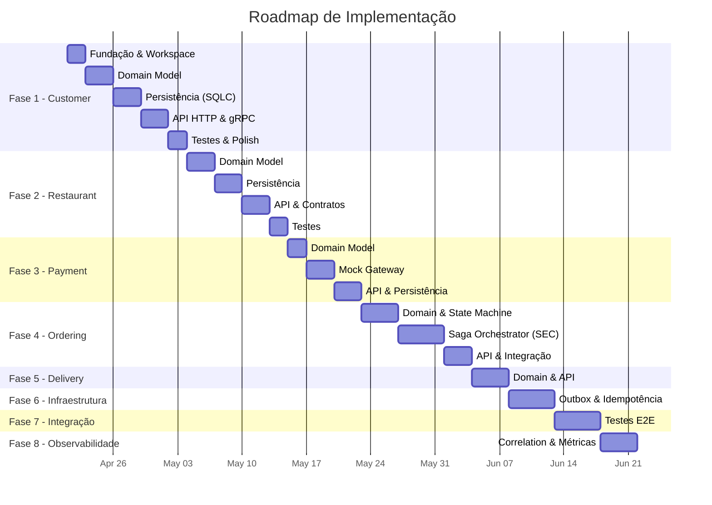
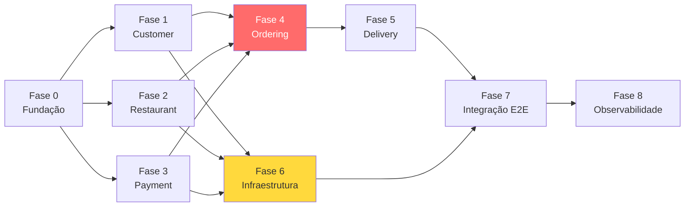

# Plano de Implementação — Food Ordering Platform

> **Versão:** 1.0  
> **Data:** 2026-04-20  
> **Baseline de Documentação:** [ARCHITECTURE.md](file:///home/souza/projects/food-ordering-ddd/docs/ARCHITECTURE.md) · [REQUIREMENTS.md](file:///home/souza/projects/food-ordering-ddd/docs/REQUIREMENTS.md)  
> **Status:** Aguardando Aprovação do P.O.

---

## Resumo Executivo

Este plano segue o **Roadmap de Implementação** definido na Seção 13 do [ARCHITECTURE.md](file:///home/souza/projects/food-ordering-ddd/docs/ARCHITECTURE.md), decompondo as 8 fases em **sprints atômicos e rastreáveis**. Cada sprint mapeia:

- **Entregáveis** concretos (artefatos de código, schemas, contratos)
- **Skills** da pasta `.skills/` necessárias para execução
- **Referências** específicas de cada skill a serem consultadas
- **Critérios de Aceite** para validação pelo P.O.
- **Dependências** entre sprints
- **Premissa Técnica:** Uso obrigatório de **TDD (Test-Driven Development)** em todos os entregáveis de código.


### Mapa de Skills Disponíveis

| Skill | Caminho | Uso Principal |
|-------|---------|---------------|
| 🏗️ **architecture-designer** | [SKILL.md](file:///home/souza/projects/food-ordering-ddd/.skills/.agents/skills/architecture-designer/SKILL.md) | Decisões arquiteturais, ADRs, diagramas, NFRs |
| 🐹 **golang-pro** | [SKILL.md](file:///home/souza/projects/food-ordering-ddd/.skills/.agents/skills/golang-pro/SKILL.md) | Implementação Go idiomática, testes, concorrência |
| 🔗 **microservices-architect** | [SKILL.md](file:///home/souza/projects/food-ordering-ddd/.skills/.agents/skills/microservices-architect/SKILL.md) | Bounded contexts, sagas, resiliência, data ownership |

---

## Visão Geral das Fases



---

## Fase 0 — Fundação do Workspace

> **Objetivo:** Criar a estrutura do monorepo Go e a infraestrutura local de desenvolvimento.

### Sprint 0.1 — Inicialização do Monorepo

| Item | Detalhe |
|------|---------|
| **Skills** | 🐹 `golang-pro` → [project-structure.md](file:///home/souza/projects/food-ordering-ddd/.skills/.agents/skills/golang-pro/references/project-structure.md) |
| **Referência Arquitetural** | [ARCHITECTURE.md §3.1](file:///home/souza/projects/food-ordering-ddd/docs/ARCHITECTURE.md) — Estrutura de Diretórios por Serviço |

**Entregáveis:**

- [ ] `go.work` configurado com módulos: `customer`, `restaurant`, `payment`, `ordering`, `delivery`, `common`
- [ ] `go.mod` de cada serviço inicializado (ex: `github.com/vterry/food-ordering-ddd/customer`)
- [ ] Módulo `common/` com pacote `pkg/` contendo:
  - Value Objects reutilizáveis (`Money`, `ID`)
  - Interfaces base (`DomainEvent`, `AggregateRoot`)
  - Utilitários (`correlation.go`, `errors.go`)
- [ ] `Makefile` raiz com targets: `build`, `test`, `lint`, `generate`, `migrate`
- [ ] `docker-compose.yml` com MySQL e RabbitMQ para dev local
- [ ] `.golangci.yml` configurado

**Critérios de Aceite:**
1. `go build ./...` compila sem erro em todos os módulos
2. `golangci-lint run ./...` sem alertas
3. `docker compose up -d` sobe MySQL (3306) e RabbitMQ (5672/15672) acessíveis

---

## Fase 1 — Customer Service

> **Requisitos cobertos:** RF-C01.1, RF-C01.3, RF-C02.3–C02.7 (Carrinho)  
> **Bounded Context:** Customer  
> **Aggregates:** Customer, Address, Cart  

> [!IMPORTANT]
> O Customer Service é o serviço **mais independente** (zero dependências de outros bounded contexts) — ideal para validar a arquitetura hexagonal antes de progredir.

### Sprint 1.1 — Domain Model (Aggregates, Entities, Value Objects)

| Item | Detalhe |
|------|---------|
| **Skills** | 🐹 `golang-pro` → [interfaces.md](file:///home/souza/projects/food-ordering-ddd/.skills/.agents/skills/golang-pro/references/interfaces.md), [generics.md](file:///home/souza/projects/food-ordering-ddd/.skills/.agents/skills/golang-pro/references/generics.md) |
| **Skills** | 🔗 `microservices-architect` → [decomposition.md](file:///home/souza/projects/food-ordering-ddd/.skills/.agents/skills/microservices-architect/references/decomposition.md) |
| **Referência** | [ARCHITECTURE.md §4.5](file:///home/souza/projects/food-ordering-ddd/docs/ARCHITECTURE.md) — Customer Context |

**Entregáveis:**

```
customer/internal/core/domain/
├── customer/
│   ├── customer.go          # Aggregate Root
│   ├── customer_test.go
│   ├── name.go              # Value Object
│   ├── email.go             # Value Object (validação)
│   ├── phone.go             # Value Object
│   └── events.go            # CustomerRegistered, CustomerUpdated
├── address/
│   ├── address.go           # Aggregate
│   ├── street.go, city.go, zipcode.go  # Value Objects
│   └── events.go            # AddressAdded, AddressRemoved
└── cart/
    ├── cart.go              # Aggregate (transiente)
    ├── cart_item.go         # Value Object
    ├── cart_test.go
    └── events.go            # ItemAdded, ItemRemoved, CartCleared
```

- [ ] `Customer` aggregate com factory method `NewCustomer(name, email, phone)`
- [ ] Value Objects com validação no construtor (fail fast)
- [ ] `Cart` aggregate com invariante: **itens de um único restaurante** (RF-C02.4)
- [ ] `CartItem` com suporte a observações por item (RF-C02.5)
- [ ] Domain Events como structs "fat" (com dados suficientes para downstream)
- [ ] Testes unitários table-driven com `-race` flag

**Critérios de Aceite:**
1. `Customer` não pode ser criado com email inválido → retorna `error`
2. `Cart.AddItem()` rejeita item de restaurante diferente → retorna `ErrDifferentRestaurant`
3. `Cart.AddItem()` aceita observação vinculada ao item
4. 100% coverage no domain model (`go test -cover`)
5. `go vet ./...` e `golangci-lint` passam

---

### Sprint 1.2 — Ports (Interfaces de Input e Output)

| Item | Detalhe |
|------|---------|
| **Skills** | 🐹 `golang-pro` → [interfaces.md](file:///home/souza/projects/food-ordering-ddd/.skills/.agents/skills/golang-pro/references/interfaces.md) |
| **Skills** | 🏗️ `architecture-designer` → [architecture-patterns.md](file:///home/souza/projects/food-ordering-ddd/.skills/.agents/skills/architecture-designer/references/architecture-patterns.md) |

**Entregáveis:**

```
customer/internal/core/ports/
├── input.go       # CustomerService interface (use cases)
└── output.go      # CustomerRepository, AddressRepository, CartRepository, EventPublisher
```

- [ ] **Input Ports** — Interfaces dos Use Cases:
  - `RegisterCustomer(ctx, cmd) → (Customer, error)`
  - `AddAddress(ctx, customerID, cmd) → error`
  - `GetCart(ctx, customerID) → (Cart, error)`
  - `AddItemToCart(ctx, customerID, cmd) → error`
  - `RemoveItemFromCart(ctx, customerID, itemID) → error`
  - `ClearCart(ctx, customerID) → error`
- [ ] **Output Ports** — Interfaces de repositório e infra:
  - `CustomerRepository` (Save, FindByID, FindByEmail)
  - `CartRepository` (Save, FindByCustomerID, Delete)
  - `EventPublisher` (Publish(ctx, events ...DomainEvent) error)

**Critérios de Aceite:**
1. Interfaces são pequenas e focadas (≤ 5 métodos cada)
2. Todas usam `context.Context` como primeiro parâmetro
3. Não há dependência de infraestrutura nas interfaces

---

### Sprint 1.3 — Application Services (Use Cases)

| Item | Detalhe |
|------|---------|
| **Skills** | 🐹 `golang-pro` → [interfaces.md](file:///home/souza/projects/food-ordering-ddd/.skills/.agents/skills/golang-pro/references/interfaces.md), [testing.md](file:///home/souza/projects/food-ordering-ddd/.skills/.agents/skills/golang-pro/references/testing.md) |

**Entregáveis:**

```
customer/internal/core/services/
├── customer_service.go
├── customer_service_test.go
├── cart_service.go
└── cart_service_test.go
```

- [ ] `CustomerService` implementando input ports: orquestra domain → repo → events
- [ ] `CartService` implementando operações do carrinho
- [ ] Testes com **mocks** dos output ports (repositórios e event publisher)
- [ ] Error handling explícito com `fmt.Errorf("%w", err)` para wrapping

**Critérios de Aceite:**
1. Application service NÃO contém lógica de negócio (delegada ao domain)
2. Testes unitários cobrem happy path e error paths
3. Cada operação publica domain events via `EventPublisher`

---

### Sprint 1.4 — Persistência (MySQL + SQLC)

| Item | Detalhe |
|------|---------|
| **Skills** | 🐹 `golang-pro` → [project-structure.md](file:///home/souza/projects/food-ordering-ddd/.skills/.agents/skills/golang-pro/references/project-structure.md) |
| **Skills** | 🔗 `microservices-architect` → [data.md](file:///home/souza/projects/food-ordering-ddd/.skills/.agents/skills/microservices-architect/references/data.md) |
| **Referência** | [ARCHITECTURE.md §8.1](file:///home/souza/projects/food-ordering-ddd/docs/ARCHITECTURE.md) — Outbox Pattern (schema) |
| **Requisitos** | RNF-08 (database per service), RNF-10 (Outbox), RNF-18 (migrations versionadas) |

**Entregáveis:**

```
customer/
├── db/
│   ├── migrations/
│   │   ├── 001_create_customers.up.sql
│   │   ├── 001_create_customers.down.sql
│   │   ├── 002_create_addresses.up.sql
│   │   ├── 003_create_carts.up.sql
│   │   └── 004_create_outbox.up.sql
│   ├── queries/
│   │   ├── customers.sql
│   │   ├── addresses.sql
│   │   ├── carts.sql
│   │   └── outbox.sql
│   └── sqlc.yaml
├── internal/adapters/outbound/persistence/
│   ├── customer_repository.go    # Implementa ports.CustomerRepository
│   ├── cart_repository.go
│   └── sqlc/                     # Código gerado pelo SQLC
```

- [ ] Migrations SQL versionadas (up/down)
- [ ] Schema `outbox_messages` conforme [ARCHITECTURE.md §8.1](file:///home/souza/projects/food-ordering-ddd/docs/ARCHITECTURE.md)
- [ ] `sqlc.yaml` configurado para MySQL
- [ ] Queries SQLC para CRUD de Customer, Address e Cart
- [ ] Repositórios implementando os Output Ports do Sprint 1.2
- [ ] Repositório grava domain events na tabela `outbox_messages` na mesma transação

**Critérios de Aceite:**
1. `sqlc generate` gera código sem erros
2. Migrations rodam com sucesso em MySQL limpo
3. Testes de integração com testcontainers (MySQL) passam
4. Operações de escrita salvam aggregate + outbox na mesma TX

---

### Sprint 1.5 — Adapters Inbound (HTTP API + gRPC)

| Item | Detalhe |
|------|---------|
| **Skills** | 🐹 `golang-pro` → [concurrency.md](file:///home/souza/projects/food-ordering-ddd/.skills/.agents/skills/golang-pro/references/concurrency.md) (context propagation) |
| **Skills** | 🔗 `microservices-architect` → [communication.md](file:///home/souza/projects/food-ordering-ddd/.skills/.agents/skills/microservices-architect/references/communication.md) |
| **Referência** | [ARCHITECTURE.md §10.1](file:///home/souza/projects/food-ordering-ddd/docs/ARCHITECTURE.md) — Ordering → Customer via gRPC |
| **Requisitos** | RF-C01.1 (cadastro), RF-C01.3 (endereços), RF-C02.3–C02.7 (carrinho) |

**Entregáveis:**

```
customer/
├── api/
│   ├── openapi/customer-api.yaml   # OpenAPI spec
│   └── proto/customer.proto        # gRPC para consultas internas
├── internal/adapters/inbound/
│   ├── http/
│   │   ├── handler.go              # net/http handlers
│   │   ├── router.go               # mux/routing
│   │   └── dto.go                  # Request/Response DTOs
│   └── grpc/
│       └── server.go               # gRPC server (GetCustomer)
├── cmd/
│   └── main.go                     # Entrypoint (wiring)
```

- [ ] **HTTP API** (net/http padrão):
  - `POST /customers` — Cadastro
  - `GET /customers/{id}` — Consulta
  - `POST /customers/{id}/addresses` — Adicionar endereço
  - `DELETE /customers/{id}/addresses/{addressId}` — Remover endereço
  - `GET /customers/{id}/cart` — Visualizar carrinho
  - `POST /customers/{id}/cart/items` — Adicionar item
  - `DELETE /customers/{id}/cart/items/{itemId}` — Remover item
  - `DELETE /customers/{id}/cart` — Limpar carrinho
- [ ] **gRPC** — `GetCustomerByID` (para o Ordering Service consultar dados do cliente - [ARCHITECTURE.md §10.1](file:///home/souza/projects/food-ordering-ddd/docs/ARCHITECTURE.md))
- [ ] `main.go` com **Dependency Injection** manual (wiring de ports → adapters)
- [ ] Health check endpoint: `GET /health/live` e `GET /health/ready`
- [ ] Graceful shutdown com `context.Context`

**Critérios de Aceite:**
1. `curl POST /customers` cria cliente e retorna 201
2. `curl POST /customers/{id}/cart/items` com restaurante diferente retorna 422
3. gRPC `GetCustomerByID` retorna dados corretos via `grpcurl`
4. `/health/ready` retorna 200 quando MySQL está up, 503 quando down
5. Dockerfile multi-stage build funciona

---

### Sprint 1.6 — Revisão & Documentação

| Item | Detalhe |
|------|---------|
| **Skills** | 🏗️ `architecture-designer` → [adr-template.md](file:///home/souza/projects/food-ordering-ddd/.skills/.agents/skills/architecture-designer/references/adr-template.md), [nfr-checklist.md](file:///home/souza/projects/food-ordering-ddd/.skills/.agents/skills/architecture-designer/references/nfr-checklist.md) |

**Entregáveis:**

- [ ] ADR-005: Decisão sobre Cart — volátil (Redis) vs persistente (MySQL)
- [ ] Atualização do `docs/PROJECT_STATE.md`
- [ ] README do serviço Customer com instruções de build/run
- [ ] Validação contra [NFR Checklist](file:///home/souza/projects/food-ordering-ddd/.skills/.agents/skills/architecture-designer/references/nfr-checklist.md)

**Critérios de Aceite:**
1. ADR documentado com alternativas e trade-offs
2. `PROJECT_STATE.md` reflete o estado atual

---

## Fase 2 — Restaurant Service

> **Requisitos cobertos:** RF-R01.1–R01.5 (Cardápio), RF-R02.1–R02.5 (Gestão de Pedidos)  
> **Bounded Context:** Restaurant  
> **Aggregates:** Restaurant, Menu, Ticket  

### Sprint 2.1 — Domain Model

| Item | Detalhe |
|------|---------|
| **Skills** | 🐹 `golang-pro` → [interfaces.md](file:///home/souza/projects/food-ordering-ddd/.skills/.agents/skills/golang-pro/references/interfaces.md) |
| **Skills** | 🔗 `microservices-architect` → [decomposition.md](file:///home/souza/projects/food-ordering-ddd/.skills/.agents/skills/microservices-architect/references/decomposition.md) |
| **Referência** | [ARCHITECTURE.md §4.2](file:///home/souza/projects/food-ordering-ddd/docs/ARCHITECTURE.md) — Restaurant Context |

**Entregáveis:**

```
restaurant/internal/core/domain/
├── restaurant/
│   ├── restaurant.go        # Aggregate Root
│   ├── address.go           # VO
│   └── operating_hours.go   # VO
├── menu/
│   ├── menu.go              # Aggregate Root
│   ├── menu_item.go         # Entity
│   ├── category.go          # VO
│   └── events.go            # MenuActivated, ItemUnavailable
└── ticket/
    ├── ticket.go            # Aggregate Root
    ├── ticket_item.go       # VO
    ├── ticket_status.go     # VO (state machine)
    └── events.go            # TicketConfirmed, TicketRejected, TicketReady, TicketCancelled
```

- [ ] `Restaurant` com `Address` e `OperatingHours`
- [ ] `Menu` com invariante: apenas um menu ativo por restaurante (RF-R01.1)
- [ ] `MenuItem` com status de disponibilidade (RF-R01.5)
- [ ] `Ticket` como representação local do pedido — state machine:
  - `PENDING → CONFIRMED → PREPARING → READY`
  - `PENDING → REJECTED`
  - `* → CANCELLED`
- [ ] Domain Events: `TicketConfirmed`, `TicketRejected`, `TicketReady`, `TicketCancelled`

**Critérios de Aceite:**
1. Não é possível ativar dois menus simultaneamente
2. `Ticket.Confirm()` só funciona no estado `PENDING`
3. Domain events são "fat" (contêm orderId, restaurantId, items)
4. Testes unitários table-driven cobrem todas as transições de estado

---

### Sprint 2.2 — Ports, Services & Persistência

| Item | Detalhe |
|------|---------|
| **Skills** | 🐹 `golang-pro` → [testing.md](file:///home/souza/projects/food-ordering-ddd/.skills/.agents/skills/golang-pro/references/testing.md) |
| **Skills** | 🔗 `microservices-architect` → [data.md](file:///home/souza/projects/food-ordering-ddd/.skills/.agents/skills/microservices-architect/references/data.md) |
| **Referência** | [ARCHITECTURE.md §9.2](file:///home/souza/projects/food-ordering-ddd/docs/ARCHITECTURE.md) — ER Restaurant |

**Entregáveis:**

- [ ] Input/Output Ports para Restaurant, Menu, Ticket
- [ ] Application Services
- [ ] Migrations SQL ([ER referência](file:///home/souza/projects/food-ordering-ddd/docs/diagrams/er-restaurant.puml))
- [ ] SQLC queries e repositórios
- [ ] Outbox integration

**Critérios de Aceite:**
1. SQLC gera sem erros
2. Testes de integração (testcontainers) passam
3. Ticket state transitions persistem corretamente

---

### Sprint 2.3 — API HTTP + Messaging Consumer

| Item | Detalhe |
|------|---------|
| **Skills** | 🐹 `golang-pro`, 🔗 `microservices-architect` → [communication.md](file:///home/souza/projects/food-ordering-ddd/.skills/.agents/skills/microservices-architect/references/communication.md) |

**Entregáveis:**

- [ ] HTTP API para gestão de cardápio (CRUD menus e itens)
- [ ] HTTP API para gestão de pedidos (listar, confirmar, recusar, sinalizar pronto)
- [ ] **RabbitMQ Consumer**: assina comando `CreateTicket` publicado pelo Ordering Service
- [ ] **RabbitMQ Consumer**: assina comando `CancelTicket`
- [ ] Publisher de eventos `TicketConfirmed`, `TicketRejected`, `TicketReady` via `restaurant.exchange`
- [ ] `main.go` com wiring completo

**Critérios de Aceite:**
1. Consumer processa `CreateTicket` e cria Ticket com status `PENDING`
2. `POST /tickets/{id}/confirm` publica `TicketConfirmed` no RabbitMQ
3. Health checks e graceful shutdown funcionam

---

## Fase 3 — Payment Service

> **Requisitos cobertos:** RF-C03.1–C03.3 (Pagamento), RF-S01.1–S01.2, RF-S02.1–S02.2, RF-S04.1–S04.3  
> **Bounded Context:** Payment  
> **Aggregate:** Payment  

### Sprint 3.1 — Domain Model & Mock Gateway

| Item | Detalhe |
|------|---------|
| **Skills** | 🐹 `golang-pro` → [interfaces.md](file:///home/souza/projects/food-ordering-ddd/.skills/.agents/skills/golang-pro/references/interfaces.md) |
| **Skills** | 🔗 `microservices-architect` → [patterns.md](file:///home/souza/projects/food-ordering-ddd/.skills/.agents/skills/microservices-architect/references/patterns.md) (Circuit Breaker) |
| **Referência** | [ARCHITECTURE.md §4.3](file:///home/souza/projects/food-ordering-ddd/docs/ARCHITECTURE.md), [§8.3](file:///home/souza/projects/food-ordering-ddd/docs/ARCHITECTURE.md) |

**Entregáveis:**

```
payment/internal/core/domain/payment/
├── payment.go              # Aggregate Root
├── payment_status.go       # VO — state machine
├── money.go                # VO
├── card_token.go           # VO (tokenizado, sem PAN)
└── events.go               # PaymentAuthorized, AuthFailed, Captured, CaptureFailed, Refunded, Released
```

- [ ] `Payment` aggregate com state machine:
  - `CREATED → AUTHORIZED → CAPTURED`
  - `CREATED → AUTHORIZATION_FAILED`
  - `AUTHORIZED → RELEASED` (compensação)
  - `CAPTURED → REFUNDED` (compensação)
- [ ] **Mock Payment Gateway** (output port + in-memory adapter para dev)
- [ ] Domain Events conforme [ARCHITECTURE.md §4.3](file:///home/souza/projects/food-ordering-ddd/docs/ARCHITECTURE.md)
- [ ] Circuit Breaker pattern no adapter do gateway (RNF-05)

**Critérios de Aceite:**
1. `Payment.Authorize()` só funciona no estado `CREATED`
2. `Payment.Capture()` só funciona no estado `AUTHORIZED`
3. `Payment.Release()` é idempotente (RF-S04.4)
4. `Payment.Refund()` é idempotente
5. Mock gateway simula sucesso/falha/timeout

---

### Sprint 3.2 — Persistência, API & Messaging

| Item | Detalhe |
|------|---------|
| **Skills** | 🐹 `golang-pro`, 🔗 `microservices-architect` → [communication.md](file:///home/souza/projects/food-ordering-ddd/.skills/.agents/skills/microservices-architect/references/communication.md) |

**Entregáveis:**

- [ ] Migrations SQL
- [ ] SQLC queries e repositório
- [ ] RabbitMQ Consumers para commands do Ordering:
  - `AuthorizePayment` → tenta autorizar → publica `PaymentAuthorized` ou `PaymentAuthorizationFailed`
  - `CapturePayment` → captura → publica `PaymentCaptured` ou `PaymentCaptureFailed`
  - `ReleasePayment` → libera → publica `PaymentReleased`
  - `RefundPayment` → reembolsa → publica `PaymentRefunded`
- [ ] Outbox para publicação de eventos
- [ ] `main.go` com wiring

**Critérios de Aceite:**
1. Consumer `AuthorizePayment` processa e publica resposta correta
2. Operações de compensação são idempotentes (retentativas não duplicam)
3. Eventos publicados em `payment.exchange` com routing keys corretas

---

## Fase 4 — Ordering Service (Saga Orchestrator)

> **Requisitos cobertos:** RF-C04.1–C04.4, RF-S01–S04 (Orquestração)  
> **Bounded Context:** Ordering  
> **Aggregate:** Order  

> [!CAUTION]
> Esta é a **fase mais complexa** — o Ordering Service é o Saga Orchestrator (SEC). Depende dos 3 serviços anteriores (Customer, Restaurant, Payment) estarem implementados e com contratos estáveis.

### Sprint 4.1 — Order Aggregate & State Machine

| Item | Detalhe |
|------|---------|
| **Skills** | 🐹 `golang-pro` → [interfaces.md](file:///home/souza/projects/food-ordering-ddd/.skills/.agents/skills/golang-pro/references/interfaces.md), [generics.md](file:///home/souza/projects/food-ordering-ddd/.skills/.agents/skills/golang-pro/references/generics.md) |
| **Skills** | 🔗 `microservices-architect` → [patterns.md](file:///home/souza/projects/food-ordering-ddd/.skills/.agents/skills/microservices-architect/references/patterns.md) (Saga) |
| **Referência** | [ARCHITECTURE.md §4.1](file:///home/souza/projects/food-ordering-ddd/docs/ARCHITECTURE.md), [§6](file:///home/souza/projects/food-ordering-ddd/docs/ARCHITECTURE.md) (Saga State Machine), [REQUIREMENTS.md §5](file:///home/souza/projects/food-ordering-ddd/docs/REQUIREMENTS.md) (Diagrama de Estados) |

**Entregáveis:**

- [ ] `Order` aggregate com **state machine completa** (10 estados):
  - `CREATED → PAYMENT_PENDING → AWAITING_RESTAURANT_CONFIRMATION → CONFIRMED → PREPARING → READY → OUT_FOR_DELIVERY → DELIVERED`
  - Caminhos de compensação: `→ REJECTED`, `→ CANCELLED`
- [ ] Domain Events: `OrderCreated`, `OrderConfirmed`, `OrderCancelled`
- [ ] `OrderItem` VO com `Money`, quantidade e observações
- [ ] Invariantes: cancelamento só no estado `AWAITING_RESTAURANT_CONFIRMATION` (RF-C04.2)
- [ ] Testes cobrindo **todos** os caminhos de estado (happy + compensação)

**Critérios de Aceite:**
1. State machine implementa exatamente o diagrama do [REQUIREMENTS.md §5](file:///home/souza/projects/food-ordering-ddd/docs/REQUIREMENTS.md)
2. `Order.Cancel()` falha em estados pós-confirmação
3. Transições inválidas retornam `ErrInvalidStateTransition`
4. Cada transição registra domain event correspondente

---

### Sprint 4.2 — Saga Execution Coordinator (SEC)

| Item | Detalhe |
|------|---------|
| **Skills** | 🔗 `microservices-architect` → [patterns.md](file:///home/souza/projects/food-ordering-ddd/.skills/.agents/skills/microservices-architect/references/patterns.md) (Saga Orchestration), [data.md](file:///home/souza/projects/food-ordering-ddd/.skills/.agents/skills/microservices-architect/references/data.md) (Saga State Persistence) |
| **Skills** | 🐹 `golang-pro` → [concurrency.md](file:///home/souza/projects/food-ordering-ddd/.skills/.agents/skills/golang-pro/references/concurrency.md) (goroutines e context) |
| **Skills** | 🏗️ `architecture-designer` → [architecture-patterns.md](file:///home/souza/projects/food-ordering-ddd/.skills/.agents/skills/architecture-designer/references/architecture-patterns.md) |
| **Referência** | [ARCHITECTURE.md ADR-001](file:///home/souza/projects/food-ordering-ddd/docs/ARCHITECTURE.md), [saga-state-machine.puml](file:///home/souza/projects/food-ordering-ddd/docs/diagrams/saga-state-machine.puml) |

**Entregáveis:**

- [ ] SEC implementa os fluxos completos conforme diagramas de sequência:
  - [Happy Path](file:///home/souza/projects/food-ordering-ddd/docs/diagrams/seq-order-happy-path.puml)
  - [Payment Failure](file:///home/souza/projects/food-ordering-ddd/docs/diagrams/seq-payment-failure.puml)
  - [Restaurant Rejection](file:///home/souza/projects/food-ordering-ddd/docs/diagrams/seq-restaurant-rejection.puml)
  - [Delivery Refusal](file:///home/souza/projects/food-ordering-ddd/docs/diagrams/seq-delivery-refusal.puml)
  - [Client Cancellation](file:///home/souza/projects/food-ordering-ddd/docs/diagrams/seq-client-cancellation.puml)
- [ ] Saga Step definitions: `execute()` + `compensate()`
- [ ] **Saga State Persistence** (tabela `saga_instances` em MySQL)
- [ ] Timeout por step com compensação automática (Risco #5 da [ARCHITECTURE.md §12](file:///home/souza/projects/food-ordering-ddd/docs/ARCHITECTURE.md))
- [ ] **Claim-based locking** para race condition de cancelamento durante confirmação (Risco #6)
- [ ] Command publishing via RabbitMQ (`ordering.exchange`):
  - `AuthorizePayment`, `CapturePayment`, `ReleasePayment`, `RefundPayment`
  - `CreateTicket`, `CancelTicket`
  - `ScheduleDelivery`, `CancelDelivery`
- [ ] Event consumers para respostas:
  - `PaymentAuthorized` / `PaymentAuthorizationFailed`
  - `TicketConfirmed` / `TicketRejected`
  - `DeliveryScheduled` / `DeliveryCancelled`

**Critérios de Aceite:**
1. Happy path: Create Order → AuthorizePayment → CreateTicket → CapturePayment → ScheduleDelivery → `CONFIRMED`
2. Payment failure: AuthorizePayment falha → Order → `REJECTED`
3. Restaurant rejection: TicketRejected → ReleasePayment → Order → `CANCELLED`
4. Client cancellation durante `AWAITING_RESTAURANT_CONFIRMATION` → CancelTicket + ReleasePayment → `CANCELLED`
5. Saga recovery: reiniciar SEC retoma saga incompleta do último step persistido
6. Race condition protegida por claim-based locking

---

### Sprint 4.3 — API, Persistência & gRPC Client

| Item | Detalhe |
|------|---------|
| **Skills** | 🐹 `golang-pro`, 🔗 `microservices-architect` |

**Entregáveis:**

- [ ] Migrations SQL (orders, order_items, saga_instances, outbox, processed_messages)
- [ ] HTTP API:
  - `POST /orders` — Criar pedido (consulta Customer via gRPC, inicia saga)
  - `GET /orders/{id}` — Status do pedido
  - `POST /orders/{id}/cancel` — Cancelar pedido
  - `GET /customers/{id}/orders` — Histórico (RF-C04.4)
- [ ] gRPC client para `customer-service` (GetCustomerByID)
- [ ] `main.go` com wiring

**Critérios de Aceite:**
1. `POST /orders` inicia saga e retorna 202 Accepted
2. Consulta gRPC ao Customer Service funciona
3. `POST /orders/{id}/cancel` respeita regra de estado

---

## Fase 5 — Delivery Service

> **Requisitos cobertos:** RF-S03.1–S03.4, RF-C05.1–C05.3  
> **Bounded Context:** Delivery  
> **Aggregate:** Delivery  

### Sprint 5.1 — Domain, Persistência & Messaging

| Item | Detalhe |
|------|---------|
| **Skills** | 🐹 `golang-pro`, 🔗 `microservices-architect` |
| **Referência** | [ARCHITECTURE.md §4.4](file:///home/souza/projects/food-ordering-ddd/docs/ARCHITECTURE.md) |

**Entregáveis:**

- [ ] `Delivery` aggregate com state machine:
  - `SCHEDULED → PICKED_UP → DELIVERED`
  - `SCHEDULED → CANCELLED`
  - `PICKED_UP → REFUSED` (cliente recusa)
- [ ] Domain Events: `DeliveryScheduled`, `DeliveryPickedUp`, `DeliveryCompleted`, `DeliveryRefused`, `DeliveryCancelled`
- [ ] RabbitMQ Consumer: `ScheduleDelivery`, `CancelDelivery`
- [ ] Publisher de eventos via `delivery.exchange`
- [ ] HTTP API:
  - `POST /deliveries/{id}/pickup` — Entregador coletou
  - `POST /deliveries/{id}/complete` — Entregue
  - `POST /deliveries/{id}/refuse` — Cliente recusou
- [ ] Migrations, SQLC, repositórios, outbox

**Critérios de Aceite:**
1. `ScheduleDelivery` cria Delivery com status `SCHEDULED` e publica `DeliveryScheduled`
2. `DeliveryRefused` → Ordering reage com `RefundPayment` + `OrderCancelled`
3. Operações idempotentes

---

## Fase 6 — Infraestrutura Transversal

> **Requisitos cobertos:** RNF-03, RNF-04, RNF-06, RNF-10  
> **Foco:** Outbox Poller, Idempotent Consumer, Dead-Letter Queues  

### Sprint 6.1 — Outbox Poller (Componente Compartilhado)

| Item | Detalhe |
|------|---------|
| **Skills** | 🐹 `golang-pro` → [concurrency.md](file:///home/souza/projects/food-ordering-ddd/.skills/.agents/skills/golang-pro/references/concurrency.md) |
| **Skills** | 🔗 `microservices-architect` → [data.md](file:///home/souza/projects/food-ordering-ddd/.skills/.agents/skills/microservices-architect/references/data.md) |
| **Referência** | [ARCHITECTURE.md §8.1](file:///home/souza/projects/food-ordering-ddd/docs/ARCHITECTURE.md) — Outbox Pattern |

**Entregáveis:**

- [ ] Componente genérico `OutboxPoller` no módulo `common/pkg/outbox/`:
  - Poll a cada N ms (configurável) buscando `published_at IS NULL`
  - Publica no RabbitMQ com publisher confirms
  - Marca `published_at` após confirmação
  - Goroutine com lifecycle management via `context.Context`
- [ ] Configuração por serviço (poll interval, batch size)

**Critérios de Aceite:**
1. Outbox poller publica mensagens pendentes em < 500ms
2. Mensagens NÃO são republicadas após serem marcadas
3. Graceful shutdown: poller para de forma limpa

---

### Sprint 6.2 — Idempotent Consumer (Componente Compartilhado)

| Item | Detalhe |
|------|---------|
| **Skills** | 🐹 `golang-pro`, 🔗 `microservices-architect` → [patterns.md](file:///home/souza/projects/food-ordering-ddd/.skills/.agents/skills/microservices-architect/references/patterns.md) |
| **Referência** | [ARCHITECTURE.md §8.2](file:///home/souza/projects/food-ordering-ddd/docs/ARCHITECTURE.md) — Idempotent Consumer |

**Entregáveis:**

- [ ] Middleware `IdempotentConsumer` no módulo `common/pkg/messaging/`:
  - Verifica `message_id` na tabela `processed_messages` antes de processar
  - Insere `message_id` após processamento bem-sucedido (na mesma TX)
  - Rejeita mensagem duplicada silenciosamente (ACK sem reprocessar)
- [ ] Integração nos consumers de todos os 5 serviços

**Critérios de Aceite:**
1. Mesma mensagem processada 3x → handler executado apenas 1x
2. Tabela `processed_messages` contém registro

---

### Sprint 6.3 — Dead-Letter Queues & Retry Policy

| Item | Detalhe |
|------|---------|
| **Skills** | 🔗 `microservices-architect` → [patterns.md](file:///home/souza/projects/food-ordering-ddd/.skills/.agents/skills/microservices-architect/references/patterns.md) (Retry Pattern) |

**Entregáveis:**

- [ ] Configuração RabbitMQ: DLQ por serviço (ex: `ordering.dlq`, `payment.dlq`)
- [ ] Retry policy: 3 tentativas com exponential backoff + jitter
- [ ] Após 3 falhas: mensagem encaminhada para DLQ
- [ ] Dashboard/endpoint para inspecionar DLQ

**Critérios de Aceite:**
1. Mensagem com handler falhando 3x vai para DLQ
2. Backoff entre retentativas: ~100ms, ~200ms, ~400ms
3. DLQ contém mensagem original com metadata de erro

---

## Fase 7 — Testes de Integração E2E

> **Requisitos cobertos:** Validação cross-context de todos os fluxos  

### Sprint 7.1 — Fluxos Happy Path

| Item | Detalhe |
|------|---------|
| **Skills** | 🐹 `golang-pro` → [testing.md](file:///home/souza/projects/food-ordering-ddd/.skills/.agents/skills/golang-pro/references/testing.md) |
| **Skills** | 🏗️ `architecture-designer` → [system-design.md](file:///home/souza/projects/food-ordering-ddd/.skills/.agents/skills/architecture-designer/references/system-design.md) |

**Entregáveis:**

- [ ] Docker Compose E2E com todos os 5 serviços + MySQL + RabbitMQ
- [ ] Testes E2E automatizados cobrindo:
  - Cadastro de cliente → Criar restaurante → Ativar menu → Adicionar ao carrinho → Criar pedido → Pagamento → Confirmação → Entrega
- [ ] Validação de eventos publicados em cada etapa

**Critérios de Aceite:**
1. Fluxo completo happy path executa em < 15s
2. Order transiciona: `CREATED → ... → DELIVERED`
3. Todos os eventos de domínio são publicados na ordem correta

---

### Sprint 7.2 — Fluxos de Compensação

| Item | Detalhe |
|------|---------|
| **Skills** | 🔗 `microservices-architect` → [patterns.md](file:///home/souza/projects/food-ordering-ddd/.skills/.agents/skills/microservices-architect/references/patterns.md) |

**Entregáveis:**

- [ ] Testes E2E para cenários de falha:
  - Pagamento recusado → Pedido rejeitado
  - Restaurante recusa → Pagamento liberado → Pedido cancelado
  - Cliente recusa entrega → Reembolso → Pedido cancelado
  - Cliente cancela durante `AWAITING_RESTAURANT_CONFIRMATION`
- [ ] Validação de que compensações são executadas na ordem inversa
- [ ] Teste de idempotência: enviar evento duplicado não causa inconsistência

**Critérios de Aceite:**
1. Cada cenário de compensação finaliza com estado consistente
2. Nenhum "pagamento fantasma" (autorizado mas nunca capturado/liberado)
3. Saga stuck é detectada e compensada após timeout

---

### Sprint 7.3 — Validação Manual (Roteiro)

| Item | Detalhe |
*   **Referência** | [manual_testing_guide.md](file:///home/souza/.gemini/antigravity/brain/4eb32fbb-f252-401a-bc83-5565603cba49/manual_testing_guide.md) |

**Entregáveis:**

- [ ] Execução do roteiro de teste manual para validação visual e de logs.
- [ ] Validação de cada cenário:
  - Happy Path (Criação -> Pagamento -> Cozinha -> Entrega Mock).
  - Compensação por recusa do restaurante.
  - Cancelamento pelo cliente.

**Critérios de Aceite:**
1. Todos os passos do roteiro executados com sucesso.
2. Logs do `Ordering Service` confirmam as transições de estado da Saga.
3. Banco de dados `saga_state` reflete o progresso em cada passo.

---

## Fase 8 — Observabilidade

> **Requisitos cobertos:** RNF-11, RNF-12, RNF-13  

### Sprint 8.1 — Correlation IDs & Structured Logging

| Item | Detalhe |
|------|---------|
| **Skills** | 🔗 `microservices-architect` → [observability.md](file:///home/souza/projects/food-ordering-ddd/.skills/.agents/skills/microservices-architect/references/observability.md) |
| **Skills** | 🐹 `golang-pro` → [concurrency.md](file:///home/souza/projects/food-ordering-ddd/.skills/.agents/skills/golang-pro/references/concurrency.md) (context propagation) |

**Entregáveis:**

- [ ] Middleware HTTP que extrai/gera `X-Correlation-ID` e injeta no `context.Context`
- [ ] Propagação de correlation ID em:
  - Headers HTTP
  - Headers gRPC (metadata)
  - Headers AMQP (RabbitMQ message properties)
  - Outbox messages (`correlation_id` field)
- [ ] Structured logging (JSON) com correlation ID em toda log line
- [ ] Log com campos: `timestamp`, `level`, `correlation_id`, `service`, `msg`

**Critérios de Aceite:**
1. Uma request ao Ordering gera logs em 4 serviços com o **mesmo** correlation ID
2. Logs são JSON válido
3. Grep por correlation ID retorna trace completo

---

### Sprint 8.2 — Métricas de Negócio

| Item | Detalhe |
|------|---------|
| **Skills** | 🔗 `microservices-architect` → [observability.md](file:///home/souza/projects/food-ordering-ddd/.skills/.agents/skills/microservices-architect/references/observability.md) |

**Entregáveis:**

- [ ] Endpoint Prometheus `/metrics` em cada serviço
- [ ] Métricas expostas:
  - `orders_total` (counter, por status)
  - `order_processing_duration_seconds` (histogram)
  - `payments_total` (counter, por resultado: authorized/failed/captured/refunded)
  - `tickets_total` (counter, por resultado: confirmed/rejected)
  - `delivery_duration_seconds` (histogram)
  - `saga_duration_seconds` (histogram)
  - `outbox_pending_messages` (gauge)
  - `dlq_messages_total` (counter, por serviço)

**Critérios de Aceite:**
1. `curl /metrics` retorna formato Prometheus válido
2. Métricas de negócio incrementam corretamente após operações

---

## Matriz de Rastreabilidade: Skills × Fases

| Fase | 🏗️ architecture-designer | 🐹 golang-pro | 🔗 microservices-architect |
|------|:---:|:---:|:---:|
| **0 — Fundação** | | ✅ `project-structure` | |
| **1 — Customer** | ✅ `adr-template`, `nfr-checklist` | ✅ `interfaces`, `generics`, `testing`, `concurrency` | ✅ `decomposition`, `data`, `communication` |
| **2 — Restaurant** | | ✅ `interfaces`, `testing` | ✅ `decomposition`, `data`, `communication` |
| **3 — Payment** | | ✅ `interfaces` | ✅ `patterns` (circuit breaker), `communication` |
| **4 — Ordering** | ✅ `architecture-patterns` | ✅ `interfaces`, `generics`, `concurrency` | ✅ `patterns` (saga), `data` (saga persistence) |
| **5 — Delivery** | | ✅ `interfaces` | ✅ `communication` |
| **6 — Infraestrutura** | | ✅ `concurrency` | ✅ `patterns` (retry), `data` (outbox/idempotent) |
| **7 — Integração** | ✅ `system-design` | ✅ `testing` | ✅ `patterns` |
| **8 — Observabilidade** | | ✅ `concurrency` | ✅ `observability` |

---

## Dependências entre Fases



> [!NOTE]
> As Fases 1, 2 e 3 podem ser executadas **em paralelo** (não possuem dependências entre si), acelerando o delivery se houver múltiplos agentes/devs.

---

## Open Questions para o P.O.

> [!IMPORTANT]
> **Q1 — Autenticação (RF-C01.2):** O requisito menciona autenticação do cliente. Devemos implementar um mecanismo real (JWT) ou um stub/mock durante o desenvolvimento dos serviços de domínio? Isso impacta a Fase 1.

> [!IMPORTANT]
> **Q2 — Cart Storage:** O Cart é definido como "transiente" na arquitetura. Preferência por persistir em MySQL (durabilidade) ou Redis (performance, TTL nativo)? Impacta Sprint 1.4.

> [!IMPORTANT]
> **Q3 — Paralelismo das Fases 1-2-3:** Deseja executar Customer, Restaurant e Payment em paralelo (sprints alternados) ou sequencialmente? Isso define o ritmo de entrega.

> [!WARNING]
> **Q4 — Escopo do Payment Gateway:** O mock gateway deve simular cenários de latência/timeout para validar o circuit breaker desde a Fase 3, ou isso fica para a Fase 7 (E2E)?
