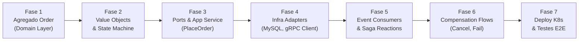
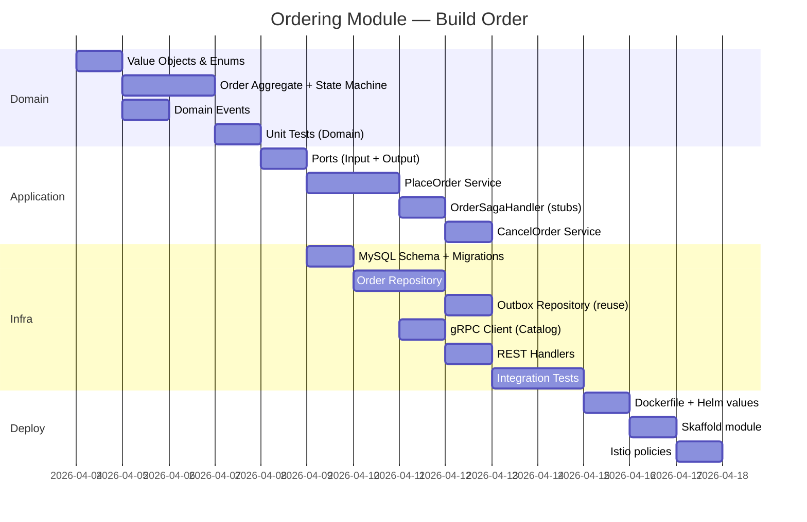

# 🏗️ Plano de Implementação — Ordering Context

> **Modo**: Mentor de Arquitetura DDD  
> **Referências**: _Software Architecture: The Hard Parts_ (Ford), _Building Event-Driven Microservices_ (Bellemare)  
> **Status do Projeto**: Catalog ✅ Completed → **Ordering 🟡 Next**

---

## Visão Geral das Fases



---

## Fase 1 — Agregado `Order` (Domain Layer Puro)

### Objetivo
Modelar o agregado `Order` com Rich Domain Model: toda lógica de transição de estado, cálculo de total, e proteção de invariantes **dentro** do agregado.

### Estrutura de Diretórios (espelhando o Catalog)

```
ordering/
├── cmd/
│   └── main.go
├── internal/
│   ├── core/
│   │   ├── domain/
│   │   │   ├── order/
│   │   │   │   ├── order.go           # Aggregate Root
│   │   │   │   ├── order_item.go      # Entity dentro do AR
│   │   │   │   ├── events.go          # Domain Events
│   │   │   │   ├── specifications.go  # Validações compostas
│   │   │   │   └── order_test.go
│   │   │   ├── valueobjects/
│   │   │   │   ├── ids.go             # OrderID, CustomerID, etc.
│   │   │   │   └── delivery_address.go
│   │   │   └── enums/
│   │   │       └── order_status.go
│   │   ├── app/
│   │   │   ├── place_order_service.go
│   │   │   ├── order_saga_handler.go   # Reage a eventos externos
│   │   │   ├── cancel_order_service.go
│   │   │   └── outbox_processor.go     # Reutilizar padrão do Catalog
│   │   └── ports/
│   │       ├── input/
│   │       │   ├── order_service.go    # Interface do Use Case
│   │       │   └── dtos.go
│   │       └── output/
│   │           ├── order_repository.go
│   │           ├── outbox_repository.go
│   │           ├── catalog_client.go   # Port para gRPC client
│   │           ├── event_publisher.go
│   │           └── unit_of_work.go
│   ├── adapters/
│   │   ├── input/
│   │   │   ├── rest/                   # HTTP handlers
│   │   │   └── messaging/             # Event consumers (Kafka/NATS)
│   │   └── output/
│   │       ├── repository/            # MySQL implementations
│   │       ├── messaging/             # Publisher implementation
│   │       └── grpc/                  # gRPC client pro Catalog
│   └── infra/
│       ├── config/
│       ├── db/
│       └── server/
├── values.yaml
├── Dockerfile
└── go.mod
```

### ⚠️ Decisões que você precisa tomar ANTES de codar

> [!IMPORTANT]
> Essas decisões impactam toda a implementação. Responda cada uma com clareza antes de prosseguir.

#### Decisão 1.1 — `OrderItem`: Entidade ou Value Object?

No Catalog, `MenuItem` é uma entidade com identidade dentro do agregado `Menu`. No Ordering, o `OrderItem` é um **snapshot** do que foi pedido.

**Pergunta**: O `OrderItem` pode mudar depois de criado? Alguém vai "editar a quantidade" de um item dentro de um pedido já criado? Se não, por que ele precisa de identidade?

| Opção | Implicação |
|-------|-----------|
| **Entity** (com `OrderItemID`) | Permite referência individual, mas abre possibilidade de mutação indevida |
| **Value Object** (imutável) | Snapshot puro, mais seguro, mas não é endereçável individualmente |

**Minha recomendação**: VO imutável. O `OrderItem` é um snapshot do momento da compra. Não existe caso de uso em que você vai "buscar o item 3 do pedido" e alterá-lo. Mas preciso que você reflita: no fluxo de cancelamento parcial futuro (se existir), isso mudaria?

---

#### Decisão 1.2 — Quem calcula o `totalAmount`?

A documentação diz: `Total = soma dos itens`. Parece simples, mas:

**Pergunta**: O cálculo do total acontece:

- (A) No **construtor** do `Order`, baseado nos snapshots de preço vindos do Catalog?
- (B) No **Application Service**, antes de instanciar o `Order`?

Se (B), você está vazando lógica de domínio para o Application Service. Se (A), o `Order` é auto-consistente.

**Minha recomendação**: O `Order` deve calcular seu próprio total internamente ao ser criado. Ele recebe os itens com preços já validados e faz a soma como invariante.

---

#### Decisão 1.3 — `OrderStatus` como Enum vs State Machine explícita

No `PROJECT_OVERVIEW.md`, a máquina de estados do `Order` tem **9 transições possíveis**. Isso é significativamente mais complexo que o `MenuStatus` do Catalog (3 estados).

**Pergunta**: Você vai implementar as transições como:

| Opção | Prós | Contras |
|-------|------|---------|
| `if/switch` nos métodos do agregado | Simples, direto | Explosão de ifs quando crescer |
| **State Pattern** (interface `OrderState`) | Transições explícitas por estado, cada estado sabe pra onde pode ir | Mais arquivos, mais boilerplate |
| **Tabela de transições** (`map[from][to]bool`) | Declarativo, fácil de visual e testar | Perde semântica dos side effects |

**Minha recomendação**: Para 7 estados e 9 transições, um `switch` dentro de cada método de domínio (como `MarkAsPaid`, `Confirm`, `Cancel`) já funciona bem. O State Pattern seria overkill aqui. Mas: **você precisa de uma tabela de transições válidas para testes!** Considere criar um helper `canTransitionTo(from, to)` para facilitar testes.

---

## Fase 2 — Value Objects & State Machine

### Artefatos
- `OrderID`, `CustomerID` — seguir padrão `BaseID[string]` do common
- `DeliveryAddress` — VO imutável com validações (street, number, city, state, zipCode)
- `OrderStatus` — enum com `String()`, `IsTerminal()`, parsing

### ⚠️ Decisão 2.1 — `DeliveryAddress` vs reutilizar um VO genérico `Address`

O Catalog tem `Address` no `Restaurant`. O Delivery vai ter `pickupAddress` e `dropoffAddress`.

**Pergunta**: Você vai:
- (A) Criar um `Address` genérico em `common/pkg` e reutilizar em todos os contexts?
- (B) Cada contexto define o **seu** VO `Address` com os campos que importam pra ele?

**Trade-off** (_Building Microservices_, Cap. 4):
- (A) reduz duplicação, mas cria **acoplamento semântico** entre bounded contexts
- (B) cada BC evolui independentemente, mas você "repete" código

**Minha recomendação**: (B). DDD puro. Cada contexto define o que um endereço significa para ele. O `DeliveryAddress` do Ordering pode ter campos como `complement` e `referencePoint` que não fazem sentido no Catalog.

---

## Fase 3 — Ports, Application Service & PlaceOrder Use Case

### Este é o fluxo mais crítico. Vou quebrá-lo em micro-decisões.

### ⚠️ Decisão 3.1 — Validação síncrona: Onde fica o gRPC Client?

O diagrama de sistema mostra:
```
Ordering → (gRPC sync) → Catalog: ValidateRestaurantAndItems
```

O Catalog já expõe o `CatalogGrpcServer.ValidateRestaurantAndItems()`.

**Pergunta**: O Application Service `PlaceOrderService` vai:
- (A) Chamar o `CatalogClient` diretamente?
- (B) Chamar o `CatalogClient` através de uma **Port** (`CatalogValidationPort`) que abstrai o protocolo?

Se (A), seu Application Service conhece gRPC. Se (B), você pode trocar gRPC por REST, ou usar um mock em testes.

**Padrão do Catalog para referência**: O Catalog faz gRPC como **Input Adapter Server**. Aqui o Ordering precisa de um **Output Adapter Client**.

```
┌──────────────────────────────────────────────────────┐
│  core/ports/output/catalog_client.go                 │
│                                                      │
│  type CatalogValidationPort interface {              │
│      ValidateOrder(ctx, restaurantID, itemIDs)       │
│          → ([]ItemSnapshot, error)                   │
│  }                                                   │
└──────────────────────────────────────────────────────┘
         ▲ implementado por
┌──────────────────────────────────────────────────────┐
│  adapters/output/grpc/catalog_grpc_client.go         │
│                                                      │
│  Chama pb.CatalogServiceClient.                      │
│  ValidateRestaurantAndItems(...)                     │
└──────────────────────────────────────────────────────┘
```

**Minha recomendação**: Sempre (B). Port + Adapter. Consistente com tudo que você já fez no Catalog.

---

### ⚠️ Decisão 3.2 — Validação paralela: Até onde ir agora?

O `ARCHITECTURE.md` define **Parallel Saga** com 3 validações síncronas:
- Thread A: Catalog (validate items)
- Thread B: Payment (validate payment method)
- Thread C: Kitchen (check availability)

Mas Payment e Kitchen ainda **não existem** (🔴 Not Started).

**Pergunta**: Você vai:
- (A) Implementar **só a validação do Catalog** agora e deixar stubs para Payment/Kitchen?
- (B) Implementar toda a infra de paralelismo (`errgroup`) já preparada, mas com ports mockadas?

**Minha recomendação**: (A) com uma prevenção:
- Implemente o `PlaceOrderService` chamando **apenas** o `CatalogValidationPort` agora
- Mas **já defina** as ports `PaymentValidationPort` e `KitchenAvailabilityPort` como interfaces com implementações no-op (`AlwaysValid`)
- Quando Payment/Kitchen ficarem prontos, você só troca a implementação

> _"Make it work, make it right, make it fast"_ — Mas neste caso, "make it right" significa **não cimentar uma chamada sequencial** que depois será paralela. Deixe o design extensível.

---

### ⚠️ Decisão 3.3 — Onde publicar o `OrderPlaced` no Outbox?

No Catalog, o `MenuRepository.Save()` persiste o agregado e a lógica de outbox fica numa chamada separada.

No Ordering, o fluxo é:
1. Validar (gRPC sync) ← **fora** da transação
2. Criar Order(PENDING) ← **dentro** da transação 
3. Persistir Order + salvar `OrderPlaced` no outbox ← **mesma** transação

**Pergunta**: O `Save()` do `OrderRepository` vai:
- (A) Persistir o agregado **e** chamar `OutboxRepository.SaveEvents()` implicitamente?
- (B) O Application Service chama `OrderRepository.Save()` e `OutboxRepository.SaveEvents()` explicitamente, ambos na mesma UoW?

**Observation sobre o Catalog**: Olhando o `MenuAppService`, o Outbox **não** é chamado no App Service! Quem faz isso? O `MenuRepository.Save()` chama internamente? Ou há outro mecanismo?

**Pergunta para você**: Verifique como o Catalog persiste eventos no outbox. Isso determina se o Ordering deve seguir o mesmo padrão ou evoluí-lo.

> [!WARNING]
> Esse é o ponto mais crítico para **Anti Dual-Write**. Se `Save(Order)` e `SaveEvents(outbox)` não compartilharem a mesma transação, você terá inconsistência.

---

## Fase 4 — Infraestrutura Adapters

### 4.1 MySQL Repository
- `OrderRepository` com `Save()` e `FindByID()`
- Esquema: tabela `orders` + tabela `order_items` (1:N)
- Reutilizar o padrão de `UnitOfWork` com `context.WithValue(ctx, txKey{}, tx)`

### 4.2 gRPC Client para Catalog
- Implementar `CatalogValidationPort` como `CatalogGrpcClient`
- Service discovery via Istio (DNS interno: `catalog.food-ordering.svc.cluster.local`)

### 4.3 REST API
- `POST /orders` → PlaceOrder
- `POST /orders/{id}/cancel` → CancelOrder
- `GET /orders/{id}` → GetOrder

### ⚠️ Decisão 4.1 — Schema de tabela: Surrogate Key + UUID

O `ARCHITECTURE.md` diz: _"Surrogate keys (auto-increment) + UUID business IDs"_.

**Pergunta**: Na tabela `orders`, qual é a PK?

| Opção | Implicação |
|-------|-----------|
| `id BIGINT AUTO_INCREMENT` (PK) + `uuid VARCHAR(36)` (UNIQUE) | Joins eficientes, UUID para API |
| `uuid VARCHAR(36)` (PK) | Simples, mas índice fragmentado |

**Padrão do Catalog**: Verificar como o Catalog faz para manter consistência.

---

## Fase 5 — Event Consumers & Saga Reactions

### Este é o ponto onde o Ordering se torna um **Orchestrator**.

### Eventos que o Ordering **consome**:

| Evento | Origem | Ação no Ordering |
|--------|--------|-----------------|
| `PaymentAuthorized` | Payment | `order.MarkAsPaid(paymentId)` → `PENDING → PAID` |
| `PaymentFailed` | Payment | `order.Cancel("PAYMENT_FAILED")` → `PENDING → CANCELLED` |
| `RestaurantOrderAccepted` | Restaurant | `order.Confirm()` → `PAID → CONFIRMED` |
| `RestaurantOrderRejected` | Restaurant | `order.Cancel("RESTAURANT_REJECTED")` → `PAID → CANCELLED` |
| `PaymentCaptureFailed` | Payment | `order.Fail("CAPTURE_FAILED")` → `CONFIRMED → FAILED` |
| `DeliveryStatusChanged(ON_ROUTE)` | Delivery | `order.MarkInDelivery()` → `CONFIRMED → IN_DELIVERY` |
| `DeliveryDelivered` | Delivery | `order.MarkAsDelivered()` → `IN_DELIVERY → DELIVERED` |
| `DeliveryStatusChanged(FAILED)` | Delivery | `order.Fail("DELIVERY_FAILED")` → `IN_DELIVERY → FAILED` |

### ⚠️ Decisão 5.1 — Estrutura do Event Consumer

**Pergunta**: Os consumers vão viver:
- (A) Num **único handler** (`OrderSagaHandler`) que faz switch no tipo do evento?
- (B) Em **handlers separados** por evento (`PaymentAuthorizedHandler`, `RestaurantRejectedHandler`, etc.)?

| Opção | Prós | Contras |
|-------|------|---------|
| (A) Centralizado | Visão clara do fluxo, fácil debugar | Classe God, tendência a crescer |
| (B) Separados | SRP, testável individualmente | Mais arquivos, visão fragmentada do fluxo |

**Minha recomendação**: (A) para começar. O Ordering É o orchestrator. _Software Architecture: The Hard Parts_ recomenda que o orquestrador tenha **visibilidade centralizada** do fluxo da saga. Se cada handler é separado, você perde a visão de "qual é o estado da saga agora?"

---

### ⚠️ Decisão 5.2 — Idempotência dos Consumers

**Pergunta crítica** (_Building Event-Driven Microservices_): O que acontece quando o mesmo evento `PaymentAuthorized` chega **duas vezes**?

Opções:
1. **Idempotent State Check**: `if order.Status == PENDING then MarkAsPaid`, senão ignora
2. **Processed Events Table**: tabela `processed_events(event_id UUID PK)` — verifica antes de processar
3. **Ambos**

**Minha recomendação**: Opção 3. A verificação de estado do domínio é a primeira barreira (barata). A tabela de idempotência é a proteção definitiva contra race conditions. Ambas dentro da mesma transação.

---

### ⚠️ Decisão 5.3 — PENDING DECISION do `ARCHITECTURE.md`: Hybrid Approach

O documento marca como pendente:
> _"When implementing the Ordering Context, evaluate whether compensations should use orchestration instead of choreography."_

**Agora é hora de decidir.**

| Caminho | Happy Path | Compensation |
|---------|-----------|-------------|
| **Full Choreography** | Cada serviço reage ao anterior | Cada serviço escuta falhas e compensa |
| **Full Orchestration** | Ordering manda comandos | Ordering manda compensações |
| **Hybrid** | Choreography no happy path | Orchestration nas compensações |

**Análise dos seus 5 cenários de erro:**

```
Cenário 1 (PaymentFailed):      1 step → Choreography OK
Cenário 2 (RestaurantRejected): 2 steps → Choreography borderline
Cenário 3 (CaptureFailed):      3 steps → Choreography perigosa
Cenário 4 (DeliveryFailed):     2 steps → Choreography OK
Cenário 5 (CustomerRefused):    3 steps → Choreography perigosa
```

**Minha recomendação**: **Hybrid**. O happy path já funciona como choreography (cada serviço reage a eventos). As compensações dos cenários 3 e 5 são complexas demais para coreografia — o Ordering (orchestrator) precisa coordenar ativamente.

**Implementação prática**: No happy path, o Ordering **publica eventos** (`OrderPaid`, `OrderConfirmed`). Nos cenários de erro, o Ordering **envia comandos** via evento (`CapturePayment`, `VoidPayment`, `CancelDelivery`, `RefundPayment`).

---

## Fase 6 — Compensation Flows

### Só implementar **depois** que a Fase 5 estiver funcional.

### Sub-fases:
1. **Cancel PENDING** (cliente cancela antes de pagar) — trivial
2. **Cancel PAID** (cliente cancela antes do aceite) → Void
3. **Restaurant Rejected** → Void
4. **Capture Failed** → Fail + CancelDelivery
5. **Delivery Failed** → Refund
6. **Customer Refused** → Cancel + CancelDelivery + Refund

> [!CAUTION]
> As fases 4-6 dependem de Payment e Delivery estarem implementados. Você implementa os **comandos** (publish events) agora e os **consumers** (no Payment/Delivery) depois.

---

## Fase 7 — Deploy K8s & E2E Tests

### Artefatos:
- `values.yaml` com config do Helm Chart `ms-base`
- Skaffold module no `skaffold.yaml` raiz
- Istio `AuthorizationPolicy` (serviço autenticado como o Catalog)
- E2E tests com TestContainers para MySQL

---

## Checklist de Riscos Arquiteturais

| # | Risco | Mitigação | Fase |
|---|-------|-----------|------|
| 1 | **Dual Write**: Order salvo mas evento não publicado | UoW transacional (Outbox na mesma TX) | 3, 4 |
| 2 | **Evento duplicado**: Consumer processa 2x o mesmo evento | Idempotência (state check + processed_events table) | 5 |
| 3 | **Validação stale**: Catalog valida item, mas item fica indisponível antes de salvar | Snapshot com preço no momento da validação (aceitar o risco de stale — *eventual consistency*) | 3 |
| 4 | **Saga sem timeout**: Pedido fica PENDING eternamente se Payment não responder | Saga deadline: job que cancela pedidos PENDING há mais de X minutos | 5 |
| 5 | **Leaking TX lock**: Chamada gRPC pro Catalog dentro do `UoW.Run()` | gRPC **antes** de abrir transação (validar → depois persistir) | 3 |
| 6 | **Order sem consumer**: evento publicado mas nenhum serviço consome | Stubs/no-op consumers até os serviços downstream existirem | 5 |
| 7 | **Correlation ID perdido**: Eventos sem traceability entre contextos | Propagar `CorrelationID` do `OrderPlaced` em todos os eventos downstream | 5 |

---

## Ordem de Implementação Sugerida



---

## 🎯 Próximos Passos (Ação Imediata)

Antes de escrever qualquer linha de código, **responda estas perguntas**:

1. **Decisão 1.1**: `OrderItem` é Entidade ou Value Object?
2. **Decisão 1.3**: Transições de estado — `switch` nos métodos ou State Pattern?
3. **Decisão 2.1**: `Address` genérico em common ou `DeliveryAddress` local?
4. **Decisão 3.2**: Validação paralela com stubs ou só Catalog por agora?
5. **Decisão 3.3**: Como o Outbox entra no fluxo de `Save()`?
6. **Decisão 5.1**: Saga handler centralizado ou handlers separados?
7. **Decisão 5.3**: **Hybrid approach** para compensações — confirmado?

Quando você tiver respostas para pelo menos as decisões 1-5, começamos a Fase 1.
